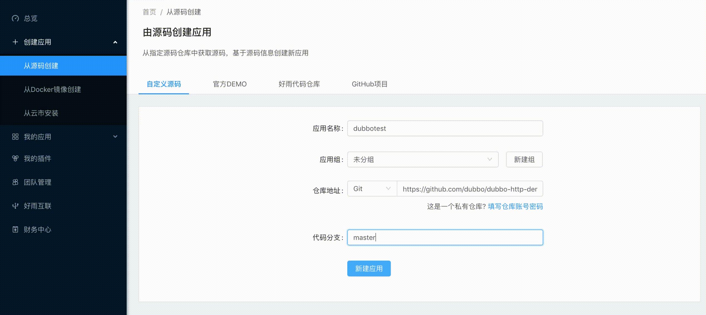
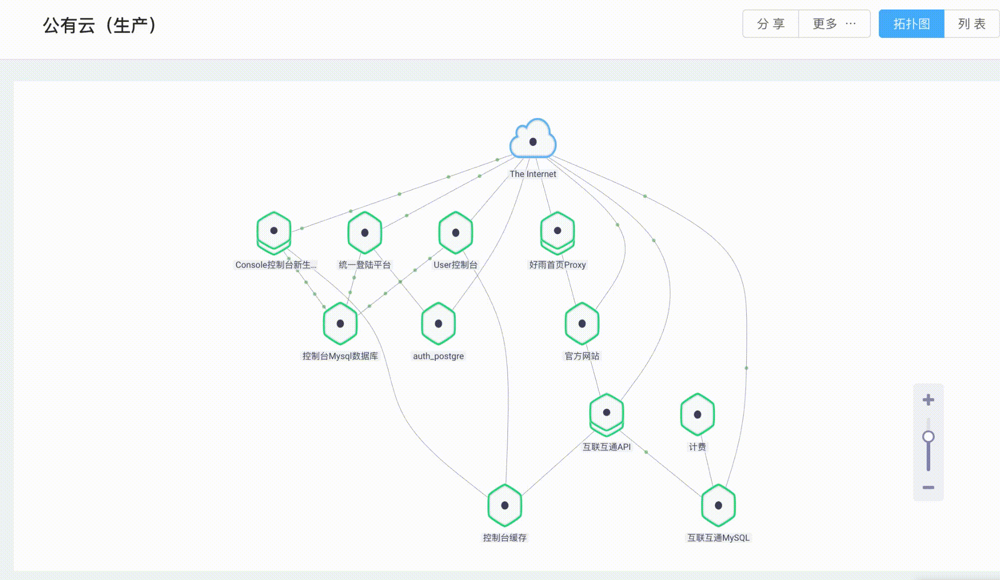

[English](README.md) | 简体中文

# kuship-ui

> 本工程基于 [rainbond-ui](https://github.com/goodrain/rainbond-ui) 提交 `9dcc296d3ec5d6cfdfc1c351bb0e50d1af0ac126` 拷贝而来，自此独立演进。原始实现保留为只读的 `reference/rainbond-ui/` git submodule，可作对照。

kuship-ui 是 kuship 项目的控制台前端工程（UMI 3.5 + DVA 2.4 + React 16.8 + Antd 3.19），与 `kuship-console`（Java Spring Boot 重写的后端）配套使用，过渡期默认对接由本仓库 `add-docker-compose-stack` 启动的 rainbond-console 测试实例。

## 后端目标切换 / Backend target

开发态（`yarn start`）下，`/console`、`/data`、`/openapi/v1`、`/enterprise-server`、`/app-server` 五条路径会通过 `config/config.js` 中的 `CONSOLE_PROXY_TARGET` 环境变量代理到同一个后端。

- **默认值**：`CONSOLE_PROXY_TARGET=http://localhost:7070`，对应本仓库 `add-docker-compose-stack` 启动的 rainbond-console 测试实例。
- **切换到 kuship-console**：`CONSOLE_PROXY_TARGET=http://localhost:<kuship-console-port> yarn start`。具体端口由 kuship-console 在后续变更中确定。

下方保留 rainbond-ui 原文档作为参考（与 kuship 业务无关的章节将在后续变更中精简）。

---

[项目官网](http://www.rainbond.com) • [文档](https://www.rainbond.com/docs/stable/) • [在线体验](https://github.com/goodrain/rainbond/blob/master/README_EN.md)

**Rainbond** 是一个以应用为中心的服务平台，具有创新的理念和完整的生态来源于不断的验证和优化。

**Rainbond** 优点:支持企业应用程序开发、体系结构、交付和运维的全过程。通过“无创”架构，无缝连接各类企业应用，底层资源可以连接和管理 IaaS、虚拟机和物理服务器。

```
企业应用程序包括:
各类信息系统、OA、CRM、ERP、数据库、大数据、物联网、互联网平台、微服务架构等系统运行在企业内部
```

通过集成基于 Kubernetes 的容器管理、服务网格微服务架构、CI/CD 和多个集群资源管理的最佳实践，Rainbond 提供了云本地应用程序的全生命周期管理，连接应用程序和基础设施、应用程序和应用程序、基础设施和基础设施。

选择 Rainbond 的原因与颠覆性公司相同:它是一个易于使用的云本地应用程序交付平台，提供敏捷开发、高效运营和精益管理经验。

## 安装

Usage(Must install [rainbond-console](https://github.com/goodrain/rainbond-console.git))

### git

```
$ git clone https://github.com/goodrain/rainbond-ui.git --depth=1
$ cd  rainbond-ui
```

### npm

```
$ npm install
```

###run demo

```
$ git clone https://github.com/goodrain/rainbond-ui.git --depth=1
$ cd  rainbond-ui
$ npm install
$ npm start         # visit http://localhost:9001
```

## 演示

## 从源代码构建



## - 应用流量拓扑图



## 社区

[Rainbond 开源社区](https://t.goodrain.com)

[Rainbond 项目官网](https://www.rainbond.com)

## 参与贡献

你可以参与 Rainbond 社区关于平台、应用、插件等领域的贡献和发布。
请移步： [Rainbond 贡献者社区](https://t.goodrain.com/c/contribution)

## 特别感谢

感谢以下开源项目

- [Kubernetes](https://github.com/kubernetes/kubernetes)
- [Docker/Moby](https://github.com/moby/moby)
- [Heroku Buildpacks](https://github.com/heroku?utf8=%E2%9C%93&q=buildpack&type=&language=)
- [OpenResty](https://github.com/openresty/)
- [Calico](https://github.com/projectcalico)
- [Midonet](https://github.com/midonet/midonet)
- [Etcd](https://github.com/coreos/etcd)
- [Prometheus](https://github.com/prometheus/prometheus)
- [GlusterFS](https://github.com/gluster/glusterfs)
- [Ceph](https://github.com/ceph/ceph)
- [CockroachDB](https://github.com/cockroachdb/cockroach)
- [MySQL](https://github.com/mysql/mysql-server)
- [GGEditor](https://github.com/gaoli/GGEditor)
- [Weave Scope](https://github.com/weaveworks/scope)
- [Ant Design](https://github.com/ant-design/ant-design)

## 加入我们

[欢迎您加入我们对您的技术热情](https://www.rainbond.com/docs/recruitment/join.html)
